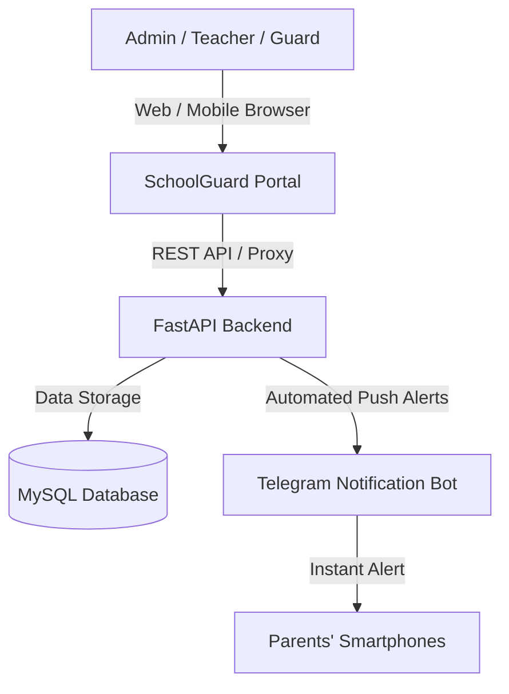
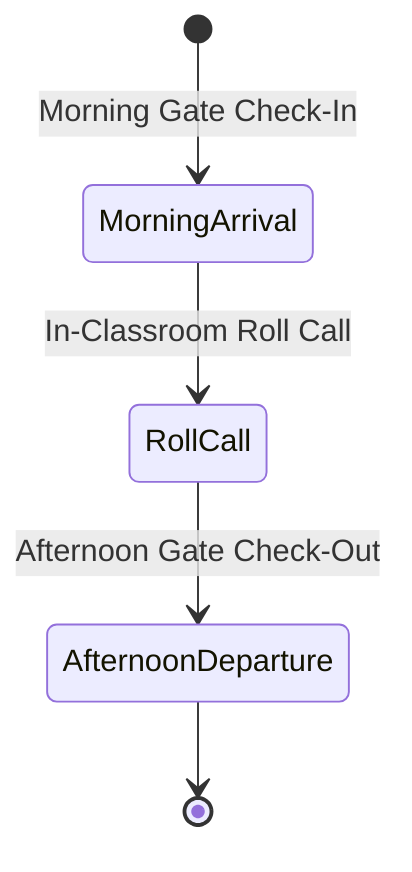

# 🛡️ SchoolGuard — Administrator User Manual

Welcome to the **SchoolGuard Administration Manual**. This guide provides step-by-step instructions for school administrators to configure, manage, and operate the SchoolGuard platform across both desktop computers and mobile devices (smartphones/tablets).

---

## 📌 Table of Contents
1. [System Overview & Architecture](#1-system-overview--architecture)
2. [Accessing the Portal (Desktop & Mobile)](#2-accessing-the-portal-desktop--mobile)
3. [User Roles & Permissions](#3-user-roles--permissions)
4. [Step 1: School & Class Configuration](#4-step-1-school--class-configuration)
5. [Step 2: Teachers & Staff Management](#5-step-2-teachers--staff-management)
6. [Step 3: Student Registration & Profiles](#6-step-3-student-registration--profiles)
7. [Step 4: Parent Accounts & Telegram Bot Linking](#7-step-4-parent-accounts--telegram-bot-linking)
8. [Step 5: Attendance Operations (Arrival, Departure & Roll Call)](#8-step-5-attendance-operations-arrival-departure--roll-call)
9. [Step 6: Notification History & Bulk Log Management](#9-step-6-notification-history--bulk-log-management)
10. [Daily Operations Checklist](#10-daily-operations-checklist)
11. [Troubleshooting & Maintenance](#11-troubleshooting--maintenance)

---

## 1. System Overview & Architecture

**SchoolGuard** is an integrated school attendance, student safety, and automated parent communication platform.



### Key Capabilities:
- **Morning Gate Arrival Tracking**: Record student arrivals via gate check, RFID, or security scanner.
- **Afternoon Gate Departure Tracking**: Ensure authorized departures at the end of the school day.
- **Classroom Roll Call (Mobile-Optimized)**: 1-tap touch buttons for *Present*, *Late*, *Absent*, and *Excused*.
- **Instant Telegram Alerts**: Automated notifications dispatched to parents using Ethiopian naming standards (**First Name + Middle / Father's Name**).
- **Cross-Device Compatibility**: Operates seamlessly on desktop computers, tablets, and smartphones.

---

## 2. Accessing the Portal (Desktop & Mobile)

### A. Logging in from the Host Desktop Computer
1. Open Google Chrome, Microsoft Edge, or Safari.
2. Navigate to:
   ```text
   http://localhost:5173
   ```
3. Enter your administrator username or email (e.g. `admin` or your registered email) and password.
4. Click **Sign In**.

### B. Logging in from a Smartphone or Tablet (Wi-Fi)
SchoolGuard can be accessed from any device connected to the school or office Wi-Fi network without installing an app:

1. Connect your smartphone to the local Wi-Fi network.
2. Open your mobile browser and enter your server's Wi-Fi IP address:
   ```text
   http://<HOST_IP>:5173
   ```
   *(Example: `http://172.16.6.90:5173`)*
3. Enter your login credentials and tap **Sign In**.

> [!TIP]
> To look up your current Wi-Fi IP address on the host PC, open PowerShell and type `ipconfig`. Look for the **IPv4 Address** under `Wireless LAN adapter Wi-Fi`.

---

## 3. User Roles & Permissions

| Role | Permitted Actions |
| :--- | :--- |
| **`ADMIN`** | Full system control: Schools, Classes, Teachers, Students, Parents, Attendance, Users, Notifications, Bulk Deletion, and Settings. |
| **`TEACHER`** | View assigned classes and students; record morning arrival, afternoon departure, and classroom roll call. |
| **`SECURITY`** | Gate check-in and check-out scanning for students entering or leaving the school compound. |
| **`PARENT`** | View attendance history for their linked child/children; configure personal notification preferences. |

---

## 4. Step 1: School & Class Configuration

Before registering students, configure your school entity and classroom sections.

### A. Add School Profile
1. Navigate to the **Schools** menu in the sidebar.
2. Click **+ Add School**.
3. Fill in the required details:
   - **School Name**: (e.g. *Apex Academy*)
   - **School Code**: (e.g. *APX-01*)
   - **Morning Start Time**: (e.g. *08:00:00* — used to determine late arrivals)
   - **Dismissal Time**: (e.g. *15:30:00* — used for departure tracking)
   - **Address & Contact Details**: Optional.
4. Click **Create School**.

### B. Add Classes & Grade Levels
1. Navigate to the **Classes** menu.
2. Click **+ Add Class**.
3. Enter:
   - **Class Name**: (e.g. *Grade 10A*)
   - **Class Code**: (e.g. *G10-A*)
   - **Grade Level**: (e.g. *10*)
   - **School**: Select the relevant school.
4. Click **Save Class**.

---

## 5. Step 2: Teachers & Staff Management

### A. Registering a Teacher
1. Go to **Teachers** (or **Users**) from the sidebar navigation.
2. Click **+ Add Teacher** (or **+ Add User**).
3. Provide:
   - **Full Name**: (e.g. *Alemayehu Tadesse*)
   - **Email Address**: (used for login)
   - **Phone Number**: (e.g. `+251911223344`)
   - **Password**: Secure password set by the admin.
   - **Role**: Select `TEACHER` (or `SECURITY` for gate guards).
4. Click **Save**.

### B. Assigning a Teacher to a Classroom
1. Go to **Teachers** &rarr; locate the **Assign Teacher to Class** section.
2. Select the **Teacher** and target **Classroom**.
3. Toggle whether they are the **Primary Class Teacher**.
4. Click **Assign Teacher**.

---

## 6. Step 3: Student Registration & Profiles

Student names follow the standard format:
- **First Name**: Given Name (e.g., *Abebe*)
- **Middle Name**: Father's Name (e.g., *Bikila*)
- **Last Name**: Grandfather's Name (e.g., *Demissie*)

### A. Adding a New Student
1. Go to the **Students** menu and click **+ Add Student**.
2. Enter:
   - **First Name**: *Abebe*
   - **Middle Name (Father's Name)**: *Bikila* *(Crucial: Used in all parent alerts)*
   - **Last Name (Grandfather's Name)**: *Demissie*
   - **Student Code**: Unique identifier (e.g. `STU-1001`).
   - **School & Class**: Select the student's assigned classroom.
   - **Gender & Date of Birth**: Optional.
3. Click **Create Student**. The system automatically generates a unique QR token for security gate scanning.

### B. Editing or Deleting a Student
- In the **Students** table, click **Edit** (pencil icon) to modify info, or **Delete** (trash icon) to remove a student and clean up associated records.

---

## 7. Step 4: Parent Accounts & Telegram Bot Linking

Connecting parents to the Telegram bot enables them to receive real-time morning arrival and afternoon departure push alerts.

### A. Register Parent Account
1. Go to the **Parents** menu &rarr; click **+ Add Parent**.
2. Enter the parent's **Full Name**, **Email**, **Phone Number**, and temporary password.
3. Click **Save Parent**.

### B. Link Parent to Student
1. On the **Parents** page, click **+ Link Student**.
2. Select the **Parent** and the **Student**.
3. Choose the relationship (*Mother*, *Father*, *Guardian*).
4. Click **Create Link**.

### C. Connecting Parent to the Telegram Bot
There are two ways to connect a parent's Telegram account:

#### Method 1: Parent Self-Service (Recommended)
1. Instruct the parent to open the SchoolGuard bot on Telegram: `@YourSchoolGuardBot`.
2. Tap **Start** (or send `/start`).
3. Tap **🔗 Link My Account** (or send `/link`).
4. The bot will prompt for their registered **email address** and **password**.
5. Once verified, the bot confirms:
   > *"✅ Account Linked Successfully! Welcome, Parent! You will now receive automatic gate alerts for your children."*

#### Method 2: Administrator Direct Link
If a parent shares their numeric Telegram ID:
1. Go to the **Parents** list in SchoolGuard.
2. Click **Connect Telegram** next to the parent's profile.
3. Enter their **Telegram User ID** (and optional `@username`).
4. Click **Save**.

---

## 8. Step 5: Attendance Operations (Arrival, Departure & Roll Call)

The **Attendance** page supports both desktop mouse operation and mobile touchscreens.

### A. The Three Registration Modes



1. **🟢 Arrival (Morning Gate Check-In)**:
   - Used by gate security or teachers at the school entrance.
   - Records arrival timestamp (e.g. `07:55 AM`).
   - Dispatches an arrival alert to the parent:
     > *✅ **Arrival Recorded***  
     > *Student: **Abebe Bikila** (Code: STU-1001)*  
     > *⏰ Arrival Time: 07:55 AM*

2. **🔴 Departure (End-of-Day Checkout)**:
   - Used when students are dismissed at the gate.
   - Automatically filters to students who arrived today.
   - Check the **"Hide already departed"** box to focus only on remaining students.
   - Dispatches a departure alert to the parent:
     > *✅ **Departure Recorded***  
     > *Student: **Abebe Bikila** (Code: STU-1001)*  
     > *⏰ Departure Time: 03:45 PM*

3. **📋 Roll Call (Status Registration)**:
   - Used by teachers inside the classroom.
   - Allows setting individual statuses: **Present**, **Late**, **Absent**, or **Excused**.
   - Dispatches immediate status alerts (e.g., notifying parents immediately if a student is marked Absent or Late).

---

### B. Mobile Touch-Friendly Roll Call Workflow (On Phone)

When opening the Attendance page on a smartphone:
1. Tap **📋 Roll Call (Status)** at the top.
2. Each student is presented as an easy-to-read **Mobile Card**.
3. Directly on each card, tap any status pill:
   - **`[ ✅ Present ]`** (Emerald green)
   - **`[ ⚠️ Late ]`** (Amber orange)
   - **`[ ❌ Absent ]`** (Crimson red)
   - **`[ ℹ️ Excused ]`** (Purple)
4. Tapping a status pill automatically selects the student and marks their status.
5. **Tip for fast morning roll call**:
   - Tap **Select All** (defaults all students to *Present*).
   - Scroll and tap **Absent** or **Late** only for the specific students missing.
   - Tap **Save & Notify Parents** at the bottom.

---

### C. Reviewing, Editing, or Deleting Attendance Records
- Scroll down to the **Attendance Log** section.
- Click **Edit** (pencil icon) to adjust an arrival/departure time or change status.
- Click **Delete** (trash icon) to remove an erroneous entry.

---

## 9. Step 6: Notification History & Bulk Log Management

The **Notifications & Logs** menu provides a complete audit trail of every message sent to parents.

### Features:
- **Delivery Status**:
  - `SENT`: Successfully delivered to parent's Telegram app.
  - `PENDING`: Queued for dispatch.
  - `FAILED`: Parent not linked or Telegram connection error.
- **Bulk Selection & Cleanup**:
  - Check individual rows or click the top header checkbox to select all.
  - Click **Delete Selected (N)** to clear old logs in bulk.
  - Single records can also be deleted individually.

---

## 10. Daily Operations Checklist

For a smooth school day, follow this standard operational rhythm:

| Time | Operation | Responsible Role | Tool / Device |
| :--- | :--- | :--- | :--- |
| **07:30 – 08:15 AM** | Morning gate check-in (**Arrival Mode**) | Security / Duty Teacher | Mobile / Tablet / PC |
| **08:20 – 08:40 AM** | Classroom roll call (**Roll Call Mode**) | Homeroom Teacher | Smartphone / Laptop |
| **12:00 PM** | Midday attendance review & absence follow-up | School Administrator | Admin Portal |
| **03:15 – 04:00 PM** | Afternoon dismissal checkout (**Departure Mode**) | Security / Duty Teacher | Gate Device |

---

## 11. Troubleshooting & Maintenance

### Q1: Why can't I access the portal from my phone?
- **Same Network**: Ensure your mobile phone is connected to the exact same Wi-Fi network as the host computer.
- **IP Address Change**: Wi-Fi routers periodically renew local IP leases. If the page doesn't load:
  1. Open PowerShell on the host PC and run `ipconfig`.
  2. Note the new IPv4 address (e.g. `172.16.6.90`).
  3. Open `http://<NEW_IP>:5173` on your phone.

### Q2: What if a parent says they didn't receive a notification?
1. Open **Parents** &rarr; verify the parent is linked to the student.
2. Verify the parent has linked their Telegram account (their username/ID should appear in the Parents table).
3. Check **Notifications & Logs** &rarr; search for the student's code to see if the notification is marked `SENT` or `FAILED`.
4. Ensure the parent has started conversation with the bot by sending `/start`.

### Q3: How do I restart the server if the PC was rebooted?
Open two terminal windows in the project directory:

**Terminal 1 (Backend):**
```powershell
py -m uvicorn backend.app.main:app --reload --host 0.0.0.0 --port 8000
```

**Terminal 2 (Frontend):**
```powershell
cd frontend
npm run dev
```

**Terminal 3 (Telegram Bot Daemon):**
```powershell
python -m backend.bot.main
```

---

*SchoolGuard Administration Manual — Version 1.0 (September 2026)*
